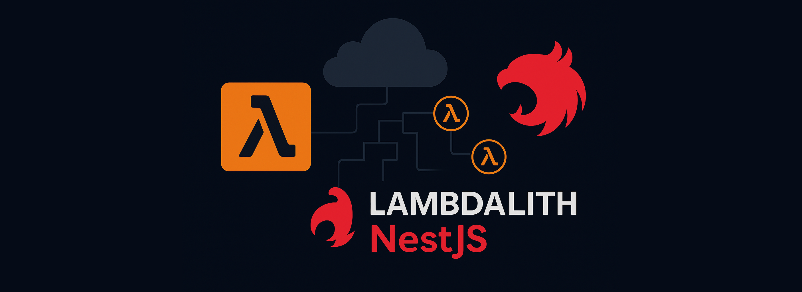
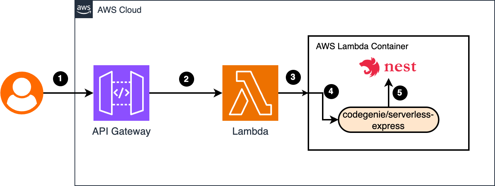

# Lambdalith with NestJS



## 🚀 Motivation

- ⚡ **Fast and cost-efficient** development and deployment using serverless infrastructure
- 🧪 Perfect fit for **prototypes and MVPs** that need to ship quickly
- 📦 Fully **Dockerized** for portability and reproducible builds
- 🔁 Combines **NestJS** with **API Gateway proxy integration**, enabling multiple endpoints within a single Lambda
- 🧩 **NestJS provides a full suite** of features like modularization, test frameworks, dependency injection
- 🔄 Provides a **smooth migration path** to containers or other compute environments later on
- 🚀 **Deploy in minutes**, not hours, days, or weeks


## 🏗 Architecture



1. User sends a request to an AWS API Gateway endpoint.
2. API Gateway uses proxy integration to forward all paths and methods directly to the Lambda function. 
3. Lambda invokes the containerized function. 
4. [@codegenie/serverless-express](https://www.npmjs.com/package/@codegenie/serverless-express) handles the incoming event. 
5. Codegenie bootstraps a NestJS app and forwards the request for processing.


### 🛠️ Deploy Instructions
```
# Authenticate with AWS (only for local deployment)
assume <DEPLOYMENT_ROLE>

# Authenticate Docker with AWS ECR Public (only for local deployment)
aws ecr-public get-login-password --region us-east-1 | \
docker login --username AWS --password-stdin public.ecr.aws

# Install dependencies
npm install

# Bootstrap environment (only once per account/region)
cdk bootstrap

# Deploy the stack
cdk deploy
```